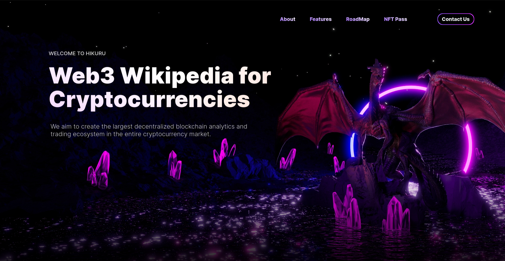

# Hikuru Quests Factory

Welcome to the Hikuru Quests Factory! Our platform is dedicated to connecting creators and participants in a dynamic and rewarding environment. By leveraging the power of the Aleo blockchain, we offer a secure and transparent system for managing and participating in quests.

## Features

- **Quest Creation**: Creators can set up quests with unique titles, descriptions, and rewards.
- **Reward System**: A flexible reward system that allows for setting maximum rewards per user and a total reward pool.
- **Participant Management**: Track and manage participants joining the quests, with limits on maximum participation.
- **Ownership Control**: Manage factory ownership and delegate control to new addresses.
- **Factory Settings**: Adjust key operational parameters of the quest factory, such as activation status and fees.
- **Random Winner Selection**: At the end of a quest, the system can select random winners from the pool of participants.
- **Privacy**: Offers both public and private quest creation methods to cater to different privacy needs.

## How It Works

## Smart Contract Methods
### Public Methods
- `quest_creation_public`: Creates a public quest.
- `quest_creation_private`: Creates a private quest.
- `acceptance_participation`: Registers a user's participation in a quest.
- `select_random_winners`: Randomly selects winners from the participants.

### Administrative Methods
- `change_owner_status`: Changes the ownership status of an address.
- `change_factory_status`: Modifies the factory settings.
- `finish_quest`: Marks a quest as completed.

### Utility Methods
- `get_participant`: Generates a unique hash for a quest participant.
- `verify_field`: Verifies a signature field.

## Native Token Transfer
This contract includes the functionality to transfer Aleo credits as part of the reward system. Ensure that the contract has enough balance to handle rewards distribution.

## Security Considerations
- Ensure all transactions are properly signed.
- Validate all inputs to prevent exploits.
- Be aware of reentrancy and state change issues.

### For Quest Creators

1. **Initialize Factory**: Set up the factory with default parameters and ownership.
2. **Create Quest**: Define the quest parameters including the reward contract, title, description, and participation details.
3. **Fund Quest**: Deposit the required Aleo credits to fund the quest rewards and fees.

### For Participants

1. **Join Quest**: Express interest in participating in available quests.
2. **Participate**: Engage with the quest activities as per the rules set by the creator.
3. **Win Rewards**: If chosen, receive rewards directly through the Aleo blockchain.

## Getting Started

To get started with Hikuru Quests Factory:

1. **Install Aleo CLI**: Make sure you have the Aleo CLI installed on your system.
2. **Deploy Contract**: Use the Aleo CLI to deploy the Hikuru Quests Factory contract.
3. **Interact with Contract**: Utilize the provided methods to create or participate in quests.

For more information on using the Aleo CLI and interacting with contracts, please visit [Aleo Documentation](https://docs.aleo.org/).

## How it Use

### `initialize_factory`

- **Purpose:** Initializes the quest factory, setting the default owner and marking the factory as active.
- **How to use:** Call this function without any parameters to initialize the factory.
- **Preconditions:** It can only be called once, and by the specified owner address in the code (`aleo1geqft...`).

### `change_owner_status`

- **Purpose:** Changes the owner status, allowing for new owners to be added or old ones removed.
- **How to use:** Provide the `editable_address` of the new owner and the `new_status` (true to add, false to remove).
- **Preconditions:** Can only be called by an existing owner.

### `change_factory_status`

- **Purpose:** Updates the factory settings like activation status and fees.
- **How to use:** Supply the `editable_index` to select which setting to change and the `new_status` to set the new value.
- **Preconditions:** Can only be called by an existing owner.

### `quest_creation_public`

- **Purpose:** Creates a new public quest with specified attributes and transfers the required fees and total reward pool to the contract.
- **How to use:** Call with the details of the quest such as `reward_contract`, `title`, `description`, and other parameters defining the quest attributes.
- **Preconditions:** The total reward pool must be transferred along with the factory fee, and the max participation must be greater than 0.

### `quest_creation_private`

- **Purpose:** Similar to `quest_creation_public`, but for private quest creation, handling the transaction privately.
- **How to use:** Call with the same parameters as `quest_creation_public`, but also include `private payment` which is a private transaction.
- **Preconditions:** A valid private payment covering fees and reward pool must be included.

### `select_random_winners`

- **Purpose:** Selects random winners for a quest after it has ended.
- **How to use:** Provide the `quest_id` and the current `time_now`.
- **Preconditions:** Can only be called by the owner, the quest must exist, and the current time must be past the quest's end time.

### `acceptance_participation`

- **Purpose:** Allows a user to participate in a quest.
- **How to use:** Call with the `quest_id` you want to participate in.
- **Preconditions:** The factory must be active, the quest must exist and not be completed, and the maximum number of participants must not have been reached.

### Utility Functions:

#### `get_participant`
- **Purpose:** Generates a unique hash for a participant of a quest.
- **How to use:** Used internally within other functions to create a hash based on `quest_id`, `hikuru_qid`, and `quests_participant_id`.
- **Preconditions:** Used within the context of participation and winner selection.

In general, when using this Aleo program, the usual steps would be:
1. Initialize the factory if it has not been initialized.
2. Use `quest_creation_public` or `quest_creation_private` to create a new quest.
3. Participants can use `acceptance_participation` to join an open quest.
4. Once a quest's end time has passed, an owner calls `select_random_winners` to distribute rewards.

Each function has specific preconditions that need to be met, and many rely on the `caller` being the owner or participant with the appropriate rights. Please ensure all the required parameters are correctly formatted and provided to avoid errors during execution.

## Contribution

We welcome contributions from the community! If you have suggestions or want to contribute to the codebase, please submit an issue or pull request on our [GitHub repository](https://github.com/hikuru-quests-factory).

## License

Hikuru Quests Factory is released under the [MIT License](https://opensource.org/licenses/MIT).

## Contact Us

For support or business inquiries, reach out to us at [contact@hikuru.com](mailto:hikuru.developer@gmail.com).

Join us in building an engaging and rewarding quest ecosystem on the Aleo blockchain!
